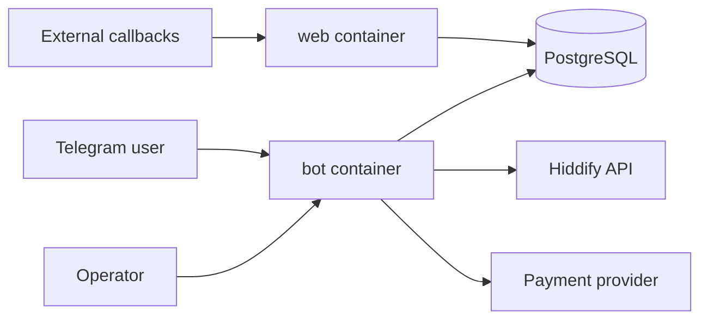

# Архитектура

`vpn-seller` демонстрирует эксплуатацию небольшого commerce/bot-сервиса: Telegram polling/web runtime, PostgreSQL, миграции, health endpoint и интеграционные тесты вокруг заказов, платежей, импортов и Hiddify.

Compose запускается без обязательного `.env`; для runtime smoke задан local-only `BOT_TOKEN` по валидному формату, но это не реальный Telegram secret. Реальные токены должны задаваться только локально или в secret manager.
